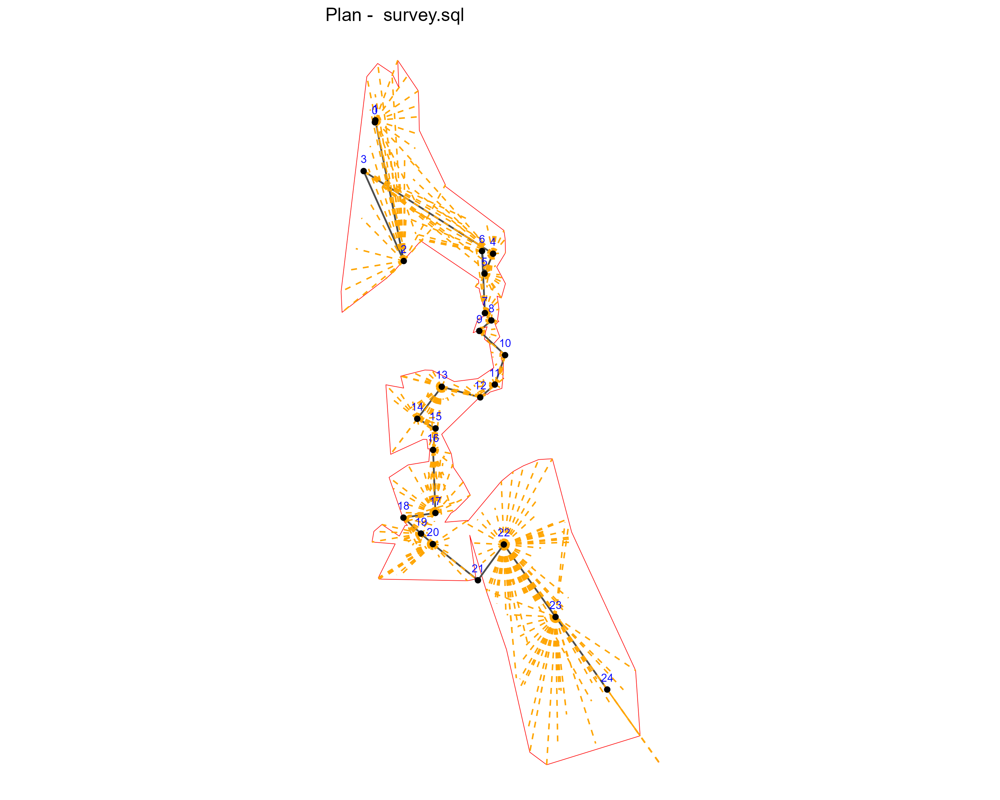

# Cave Mapper

Cave Survey Viewer is an R/Shiny application that generates 2D plan maps from cave survey data in SQL format.  
It allows visualization of survey stations and shot connections, with options to rotate and mirror the map.

## Features

- Upload cave survey data exported from cave mapping tools (as SQL).
- Parse and visualize shot data (stations, distances, angles).
- Generate 2D plan maps from survey data.
- Built with R and `ggplot2`, designed to be extended with interactive features.

## Example Use Case

The current version is tailored for working with survey data from **Dupnisa Cave**, but it is designed to be flexible for other caves as well.

## Technologies Used

- R
- Shiny
- ggplot2
- SQL data parsing (custom)

## Demo

Try the live demo here: [Cave Survey Viewer](https://aarday.shinyapps.io/cave-map-shiny/)


## Screenshot



---
## Data Format

The app reads cave survey data from an SQL file containing three main tables:

- **surveys**: contains general information about each survey, e.g. survey ID, cave name, survey date, surveyors, and metadata.

- **plots**: contains survey station details such as station IDs, names, and coordinates.

- **shots**: contains individual survey shot data connecting stations, including distances, angles, inclinations, and other measurement metadata.

### Example SQL Inserts

```sql
INSERT into surveys values( 13, "CAVE1", "2012.05.20", "CaverA, CaverB, CaverC,", 1080.0000, "17 may 2025", "0", 0, 0, 0 );

INSERT into plots values( 13, 1, "1p", 1, 0, "1", "", 88.31, -436.16, 0.57, 0.00, 0.00, "", "", 0, 0, -1.00 );

INSERT into shots values( 13, 1, "0", "1", 0.39, 12.75, 70.06, 325.00, 23979.00, 27517.00, -59.17, 1, 0, 0, 0, "", 0, 1337538074, 0, 0.00, "00:13:43:A6:2F:6C" );
```
## Notes on Data Source

The initial dataset used in this project was collected with laser distance meters (Disto) and processed through TopoDroid, a popular cave surveying application.  
As this project is still in development, some data errors or inconsistencies may appear. Further improvements and bug fixes will be implemented in future updates.


